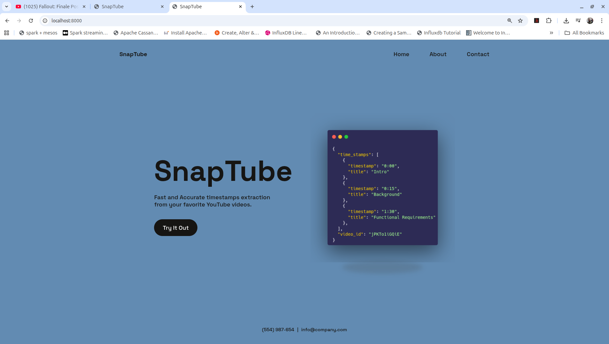

# TimeSnap
## Overview

> This is an easy to use web service used to extract timestamps from YouTube videos. Built to teach beginners the process of data collection and annotation for the pretraining, finetuning and deployment of a transformer based small language model.

