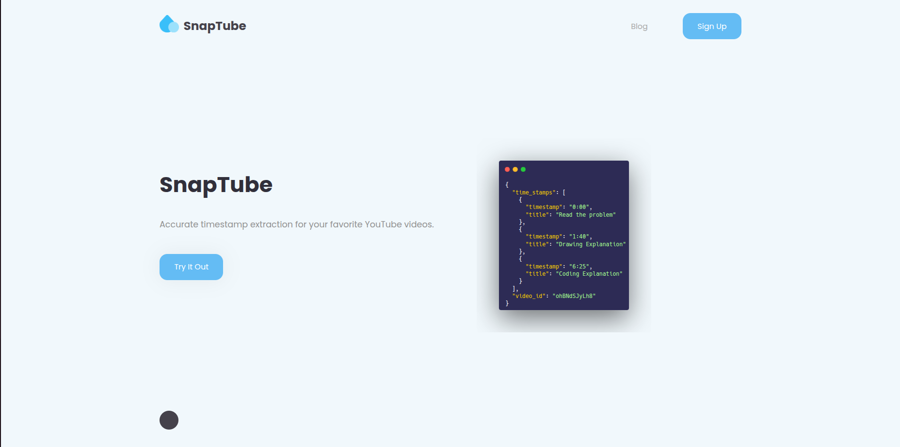

# timesnap
A web service for extracting timestamps from youtube videos.
# SavannahFaces
## Overview

> This is a web service for generating realistic Kenyan faces. The user creates an account, logs into the account and then is able to generate realistic looking images by prompting our model.

#### Application Demo
1. The user signs up for an account
2. The user then logs into the created account
3. The user types in a prompt
4. The model generates and displays the generated image.
5. The user can then download the image.

#### Application Features
1. A user management system 
2. Authentication and authorisation using both passwords and social oauth (Google and GitHub)
3. Session management using cookies and jwts
4. Rate limiting
5. Logs, traces and metrics are collected 
6. Payment processing using both MPesa and Stripe
7. A custom trained model for image generation(diffusion model)
8. A custom data pipeline for image processing

## Local Setup
#### Requirements
1. A linux machine
2. Python3.12
3. A google account
4. Docker and docker-compose installed

#### Running the application
The application consists of two services, a database and a cache. The services are:
- The web service that the user interacts with and manages user data
- The ml service that generates the images

The service uses PostgreSQL and Redis

To get started:
1. Clone the GitHub repo
```sh
  git clone https://github.com/twyle/FarmBuddy.git
```
2. Navigate to the project directory:
```sh
cd FarmBuddy/farm-assistant/app
```
3. Create the environment variables. This includes ```.ml.env```, ```.db.env``` and ```.web.env`` for the database and the two services. Check the examples provided.
4. Launch the application:
```sh
docker compose up --build
```
5. Open the application at:  ```http:0.0.0.0:8000/```

## The Services
The application consists of three distinct services:
- The Data Service
- The Ml service
- The web service

#### The Data Service
This service is used in the data generation, cleaning and labelling.

#### The ML Service
This service has three components:
- The Training Pipeline
- The Finetuning Pipeline
- The Deployment pipeline

> The training pipeline trains a diffusion model that generates faces. Uses the celebs faces dataset

> The Finetuning pipeline then finetunes the trained model on kenyan faces. Uses a private dataset

> The deployment pipeline deploys the model to modal.

